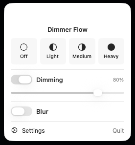
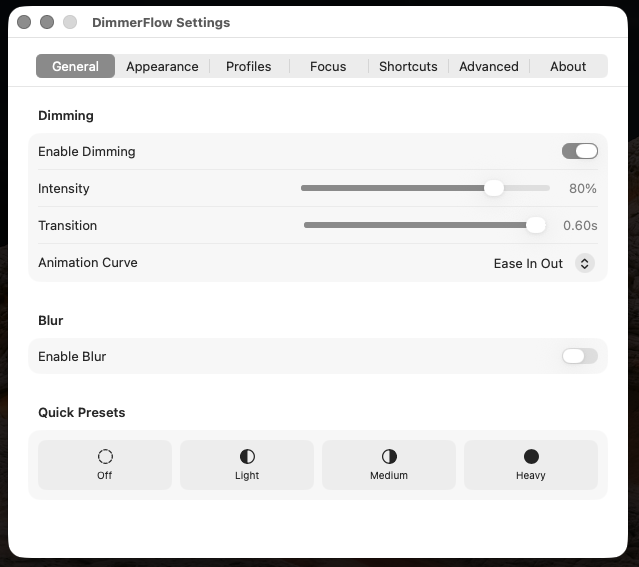

<div align="center">

# DimmerFlow

**A lightweight focus dimmer for macOS**

*Dims everything except your active window so you can concentrate on what matters.*


[](https://github.com/okandogubudak/DimmerFlow/actions/workflows/build.yml)

</div>

---

## Screenshots

<div align="center">

&nbsp;&nbsp;

</div>

### Demo

<div align="center">

https://github.com/user-attachments/assets/demo.mov

> *See how DimmerFlow smoothly dims background windows as you switch focus.*

</div>

---

## Features

### Core
- **Smart Dimming** — Automatically dims all windows except the focused one
- **Background Blur** — Optional blur effect on dimmed windows
- **Tint Color** — Customizable overlay color (true black or any color)
- **Menu Bar Dimming** — Optionally dim the menu bar area
- **Multi-Display Support** — Dim non-active displays independently

### Presets & Profiles
- **Quick Presets** — One-click switching between Off, Light, Medium, and Heavy profiles from the menu bar
- **Per-App Profiles** — Custom dim/blur levels for specific applications
- **Add from Running Apps** — Quickly create profiles from currently running apps

### Focus Tools
- **Pomodoro Timer** — Built-in focus sessions with configurable work/break durations
- **Auto-Dim Breaks** — Automatically disable dimming during Pomodoro breaks
- **Schedule** — Set active hours for automatic dimming (supports overnight ranges)

### Visual
- **Animation Curves** — Choose from Linear, Ease In, Ease Out, Ease In Out, or Spring transitions

### Productivity
- **Battery-Aware Mode** — Automatically reduce dim/blur intensity on battery power
- **Custom Keyboard Shortcuts** — Rebind increase, decrease, and toggle hotkeys
- **Fullscreen Awareness** — Auto-hide overlays in fullscreen apps
- **Idle Dim** — Increase dimming after a configurable inactivity period
- **Search Panel Exclusion** — Auto-pause for Spotlight, Raycast, Alfred, and LaunchBar
- **Smart Window Tracking** — Switches to previous app when a window is closed/minimized

### System Integration
- **Launch at Login** — Optional automatic startup via SMAppService
- **Automation Support** — Control via distributed notifications or CLI arguments
- **Accessibility-First** — Clean permission onboarding flow

---

## Requirements

- macOS 13.0 (Ventura) or later
- Accessibility permission (prompted on first launch)

## Installation

### Download
Download the latest `.app` from [Releases](../../releases).

### Build from Source

```bash
git clone https://github.com/okandobudak/DimmerFlow.git
cd DimmerFlow
swift build -c release
```

To create a packaged `.app` bundle:

```bash
chmod +x scripts/package_app.sh
./scripts/package_app.sh
```

The app will be placed on your Desktop.

---

## Usage

DimmerFlow runs as a **menu bar app** (no Dock icon). Click the menu bar icon to:

1. **Switch presets** — Quick toggle between Off / Light / Medium / Heavy
2. **Adjust dim & blur** — Fine-tune intensity with sliders
3. **Control Pomodoro** — Start/stop focus sessions
4. **Open Settings** — Full configuration panel

### Default Keyboard Shortcuts

| Action | Shortcut |
|---|---|
| Increase Dim | `⌘⌥⌃ =` |
| Decrease Dim | `⌘⌥⌃ -` |
| Toggle Dimming | `⌘⌥⌃ 0` |

All shortcuts are fully customizable in Settings → Shortcuts.

### Automation

Control DimmerFlow from scripts or other apps:

```bash
# Via launch arguments
open DimmerFlow.app --args --enable
open DimmerFlow.app --args --disable
open DimmerFlow.app --args --toggle

# Via distributed notifications (from any process)
# Send: com.dimmerflow.enable / com.dimmerflow.disable / com.dimmerflow.toggle
```

---

## Architecture

```
Sources/
├── FocusCore/          # Settings model, Pomodoro timer
│   ├── AppSettings.swift
│   └── PomodoroTimer.swift
├── FocusSystem/        # Window monitoring, permissions
│   ├── FocusMonitor.swift
│   ├── PermissionManager.swift
│   ├── WindowModels.swift
│   └── WindowServerQuery.swift
├── FocusUI/            # Overlay windows, UI, preferences
│   ├── OverlayCoordinator.swift
│   ├── OverlayWindow.swift
│   ├── PreferencesView.swift
│   ├── StatusBarController.swift
│   └── PermissionOnboarding.swift
└── DimmerFlow/         # App entry point
    ├── AppController.swift
    └── main.swift
```

Built with **Swift Package Manager** using 4 modular targets:
- **FocusCore** — Data models and settings persistence
- **FocusSystem** — AX API integration and window tracking
- **FocusUI** — Overlay rendering and SwiftUI preferences
- **DimmerFlow** — Application entry point and lifecycle

---

## License

MIT License — see [LICENSE](LICENSE) for details.

---

<div align="center">
<sub>Built by <a href="https://github.com/okandobudak">Okan Doğu BUDAK</a></sub>
</div>
