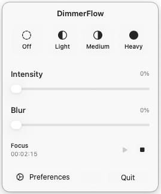
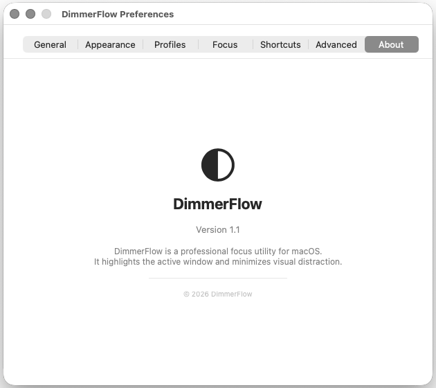
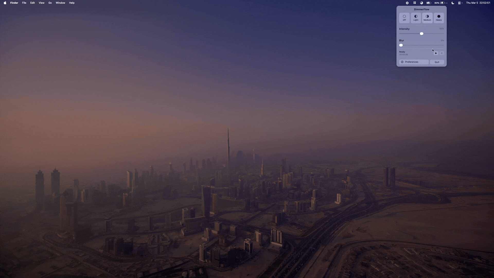

# DimmerFlow

DimmerFlow is a focused menu bar utility for macOS that keeps attention on the active window with adaptive dimming controls.

## v1.1 Highlights

- Refined glass-style popover interface
- Improved menu bar icon states based on dim level
- Pomodoro controls with menu bar timer panel
- Centered preferences window behavior
- Updated keyboard shortcuts and control flow tuning

## Preview

### Screenshots




### GIF Demos




## Core Features

- Real-time active-window dimming
- Quick presets: `Off`, `Light`, `Medium`, `Heavy`
- Dim and blur intensity sliders
- Global shortcuts for increase, decrease, and toggle
- Pomodoro timer with start/stop controls and completion alert
- Per-day scheduling options
- Inactivity-aware behavior

## Default Shortcuts

- Increase: `⌘⌥Ç`
- Decrease: `⌘⌥Ö`
- Toggle: `⌘⌥.`

## Requirements

- macOS 13+
- Accessibility permission enabled

## Build

```bash
swift build -c release
chmod +x scripts/package_app.sh
./scripts/package_app.sh
```

Build output: `~/Desktop/DimmerFlow.app`

## License

MIT. See [LICENSE](LICENSE).
